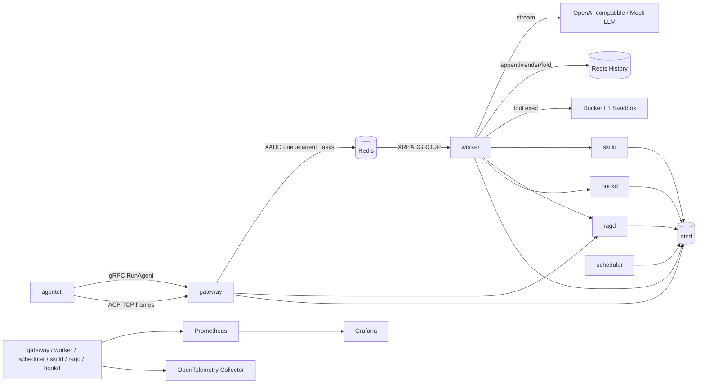

# AgentForge — 云原生 AI Agent Runtime 设计文档

> **当前状态：W10 完成。**
>
> AgentForge 是一个用 Go 实现的 AI Agent 运行时作品集项目。它重点展示：流式执行、沙箱工具调用、动态上下文装配、多 Agent 编排、Hook 扩展、服务发现、可观测性和可复现压测。

一句话简历版：

> 基于 Go 构建云原生 AI Agent Runtime，提供 gRPC/ACP 双入口、Redis Stream worker 执行、Docker L1 沙箱工具、Skill/RAG 动态上下文、Supervisor/Pipeline 多 Agent 编排、WASM Hook、etcd-backed scheduler election，以及 Prometheus/Grafana 可观测能力。

---

## 1. 项目定位

AgentForge 不是一个单点聊天机器人，而是一个“让 Agent 像后端任务一样被提交、调度、隔离、观测”的运行时基座。

主仓库只做通用 runtime：

- 稳定入口：`RunAgent` gRPC、ACP framed stream、`agentctl run`
- 执行链路：gateway、Redis Stream、worker、LLM provider、history
- 工具隔离：Docker L1 sandbox、内置 bash/fs/http tools
- 上下文工程：mutable history、Skill selector、RAG retrieval、context compaction
- 编排：local Supervisor subagent、pipeline DAG
- 扩展：wazero Hook、Skill/RAG/Hook 独立服务
- 调度面：etcd discovery、scheduler leader/pick
- 可观测：OpenTelemetry、Prometheus、Grafana、mock bench

企业 Lark 中台是另一个 fork / branch 的业务实例方向，不写入 main。主仓库通过 CLI/gRPC 给它提供能力。

---

## 2. 总体架构



核心原则：

- **外部 API 稳定**：W5-W10 都不破坏 `RunAgent`、ACP framing、tool schema。
- **能力在 worker/service 层演进**：Skill、RAG、Hook、Multi-Agent 都是 prompt/context/tool 组装能力。
- **失败可回退**：Skill/RAG/Hook 服务不可用时，默认回退到上一阶段纯文本/tool-calling 路径。
- **演示优先可复现**：mock LLM、deterministic selector、hash embedding、mock bench 让没有真实 key 的环境也能验收。

---

## 3. Run 执行链路

一次 `agentctl run` 的稳定路径：

1. `agentctl` 通过 gRPC 或 ACP 连接 gateway。
2. gateway 生成 `run_id` / `trace_id`，把任务写入 Redis Stream。
3. worker 通过 consumer group 消费任务。
4. worker 写入 user message 到 history。
5. worker 选择 Skill，检索 RAG，执行 PreLLM Hook。
6. worker 按顺序组装 LLM context：
   - base system prompt
   - selected Skill content
   - RAG `<untrusted>` chunks
   - Hook-injected system messages
   - rendered history
7. worker 调用 OpenAI-compatible 或 mock LLM provider。
8. 如果模型请求 tool，worker 执行本地 tool loop；PreToolUse/PostToolUse Hook 可 deny、改写、脱敏。
9. 如果模型请求 `dispatch_subagent`，worker 本地创建 child run，父 run 只记录结构化结果。
10. history 超阈值时触发 `COMPACTING`，调用 `History.Fold` 折叠旧消息。
11. worker 通过 Redis Pub/Sub 发布 token/state/done，gateway 流式回传给客户端。

---

## 4. 模块设计

### 4.1 Gateway + ACP/gRPC

gateway 同时提供：

- gRPC `AgentService.RunAgent`：生产友好的标准 RPC 入口。
- ACP：自研 TCP framed stream，用于展示协议设计、断线续传和自定义流控空间。

W10 已实现 ACP 帧编解码、session、event cache、resume。Window Update、zstd compression、零拷贝热路径和 MCP bridge 是未来增强，不作为已交付能力宣传。

ADR：[`docs/adr/001-acp-vs-grpc.md`](./docs/adr/001-acp-vs-grpc.md)

### 4.2 Redis Queue + Mutable History

Redis 在当前版本承担三类职责：

- Stream：`queue:agent_tasks`、tool 请求/响应流。
- Pub/Sub：`events:{run_id}` 实时事件回推。
- Hash/ZSet：message history、ACP event cache。

History 支持 append、patch、hide、fold。W7 compaction 基于 `History.Fold` 折叠旧消息，让长会话保留关键上下文。

### 4.3 Docker L1 Sandbox + Tool

已实现 Docker L1 sandbox：

- `network=none`
- read-only rootfs + tmpfs
- `cap_drop ALL`
- `no-new-privileges`
- memory/cpu/pids limit
- per-run workspace bind mount
- prewarmed container pool

内置 tools：

- `bash`
- `fs_read`
- `fs_write`
- `fs_list`
- `http_fetch`

`http_fetch` 故意在 worker 主进程执行，因为 sandbox 默认无网；它通过 allow-list 和 max bytes 限制风险。

gVisor、Firecracker、eBPF syscall audit、CRIU checkpoint restore 是已设计未实现的未来 hardening，不写进已交付简历亮点。

ADR：[`docs/adr/002-sandbox-l1-scope.md`](./docs/adr/002-sandbox-l1-scope.md)

### 4.4 Skill Selector

W5 实现 `skills/**/SKILL.md` 索引与 deterministic selector：

- 轻量 frontmatter parser，只读取 `name` / `description`。
- 记录 `sha256`、路径、完整内容。
- 重复 name、空字段会报错。
- 路径稳定排序，selector 输入可复现。
- `RuleSelector` 根据 query 与 name/description/content 的词匹配打分。
- `CachedSelector` 按规范化 query hash 做 TTL + 容量缓存。

W8 后 worker 默认通过 `skilld` 调用 Skill 服务。

### 4.5 RAG

W6 实现 pgvector-backed RAG vertical slice：

- 支持文本/Markdown/代码文件通用切片。
- 默认 deterministic hash embedder，便于无外部 embedding key 的 demo。
- Postgres + pgvector 存储 chunk。
- hybrid vector + full-text scoring。
- keyword reranker。
- tenant filter、min-score、top-k。
- `agentctl rag ingest/query`。

PDF/docx、tree-sitter 深度解析、真实 embedding provider、bge reranker 是后续增强。

### 4.6 Multi-Agent + Pipeline

W7 实现两个可演示入口：

- Supervisor：LLM 可调用 `dispatch_subagent(role, task, output_schema)`；worker 本地执行 child run，child history 独立。
- Pipeline：`agentctl pipeline run --file examples/pipeline/readme-review.yaml`；gateway 解析 DAG，拓扑排序，按依赖注入前序输出。

Swarm voting、跨 worker subagent dispatch 是未来增强。

### 4.7 WASM Hook + 服务拆分

W8 把 Skill/RAG/Hook 拆成独立 gRPC 服务：

- `skilld`: `SelectSkills`
- `ragd`: `IngestRAG` / `QueryRAG` / `RetrieveContext`
- `hookd`: `ExecuteHook` / `ListHooks`

Hook runtime 使用 `wazero` 执行 WASI-style wasm：

- stdin 接 JSON request
- stdout 返回 JSON response
- 支持 `PreLLM`、`PostLLM`、`PreToolUse`、`PostToolUse`

demo hook 覆盖：

- 危险 bash deny
- 企业安全 system context 注入
- 模拟 secret 脱敏

ADR：[`docs/adr/003-w8-service-split.md`](./docs/adr/003-w8-service-split.md)

### 4.8 Scheduler + etcd

W8 引入 etcd：

- 服务通过 lease 注册。
- scheduler 使用 etcd concurrency election 竞选 leader。
- `SchedulerService.Leader` 返回当前 leader。
- `SchedulerService.Pick` 由 leader 根据 worker heartbeat 中的 load/in-flight/concurrency 选择低负载 worker。

W10 真实边界：`Pick` 是可演示调度控制面，尚未接入 worker-specific queue shard；主执行链路仍是 Redis Stream consumer group 抢占式消费。

### 4.9 Observability + Bench

W9 接入：

- OpenTelemetry tracing
- Prometheus metrics
- metrics HTTP endpoint
- Grafana provisioning
- mock RunAgent bench
- `WEEX_API_KEY` fallback

指标只使用低基数字段作为 label，例如 `service`、`status`、`kind`、`tool`、`provider`、`event`，不把 prompt、run_id、trace_id 放入 label。

Loki/Tempo 暂未引入；Grafana W10 主要展示 Prometheus dashboard。性能数字以 [`docs/W9_BENCH_REPORT.md`](./docs/W9_BENCH_REPORT.md) 的本机实测记录为准，不写未经验证的 5k/3.8x/固定覆盖率结论。

ADR：[`docs/adr/004-w9-observability.md`](./docs/adr/004-w9-observability.md)

---

## 5. Roadmap

| 周 | 阶段 | 交付 | 状态 |
|---|---|---|---|
| W1 | 骨架 | gateway + scheduler + worker + Redis + streaming run | ✅ 完成 |
| W2 | ACP 协议 | framed TCP、断线续传、ACP/gRPC 双入口、bench 工具 | ✅ 完成 |
| W3 | Sandbox L1 | Docker sandbox、预热池、5 个内置 tools | ✅ 完成 |
| W4 | Tool Calling + History | OpenAI-compatible tool loop、History Fold | ✅ 完成 |
| W5 | Skill | Skill indexer、RuleSelector、cache、内置 skills | ✅ 完成 |
| W6 | RAG | chunk、hash embedding、pgvector、CLI ingest/query | ✅ 完成 |
| W7 | Multi-Agent | Supervisor、Pipeline DAG、context compaction | ✅ 完成 |
| W8 | Hook + 拆服务 | skilld/ragd/hookd、wazero hook、etcd election、Pick/Leader | ✅ 完成 |
| W9 | 可观测 + 压测 | OTel、Prometheus、Grafana、mock RunAgent bench | ✅ 完成 |
| W10 | 打磨 + 交付 | README、启动文档、架构图、ADR、demo 脚本、简历话术、验收清单 | ✅ 完成 |

---

## 6. W10 交付材料

- 一页式交付说明：[`docs/FINAL_DELIVERY.md`](./docs/FINAL_DELIVERY.md)
- 最终验收清单：[`docs/ACCEPTANCE_CHECKLIST.md`](./docs/ACCEPTANCE_CHECKLIST.md)
- 架构图：[`docs/ARCHITECTURE.md`](./docs/ARCHITECTURE.md)
- 3 分钟 demo 脚本：[`docs/DEMO_SCRIPT.md`](./docs/DEMO_SCRIPT.md)
- 简历与面试话术：[`docs/RESUME_TALK_TRACK.md`](./docs/RESUME_TALK_TRACK.md)
- 企业 Lark 中台 fork 计划：[`docs/ENTERPRISE_OPS_DEMO.md`](./docs/ENTERPRISE_OPS_DEMO.md)
- ADR:
  - [`docs/adr/001-acp-vs-grpc.md`](./docs/adr/001-acp-vs-grpc.md)
  - [`docs/adr/002-sandbox-l1-scope.md`](./docs/adr/002-sandbox-l1-scope.md)
  - [`docs/adr/003-w8-service-split.md`](./docs/adr/003-w8-service-split.md)
  - [`docs/adr/004-w9-observability.md`](./docs/adr/004-w9-observability.md)

最终检查：

```bash
make final-check
```

它会串联：

```bash
make proto
go test ./...
go build ./cmd/...
make obs-config
git diff --check
```

---

## 7. 企业中台实例规划

项目分成两个仓库/分支：

1. **完整 AI runtime 系统 (`main`)**
   - 保持通用 Agent runtime 定位。
   - 不引入 Lark 业务依赖。
   - 只提供 CLI/gRPC/ACP/Skill/RAG/Hook/Pipeline 等基础能力。

2. **企业 Lark 中台实例（fork / branch）**
   - 建议仓库：`AgentForge-Enterprise-Ops-Copilot`
   - 建议分支：`demo/lark-ops-center`
   - 调用 `lark-cli` / 飞书 OpenAPI，实现研发运维智能工单中台。

实例仓库可以做：

- 飞书消息转 AgentForge Run。
- RAG 导入企业文档、Runbook、事故复盘。
- Pipeline 编排 log analyst、runbook agent、release reviewer、risk reviewer。
- 结果回写飞书 IM / Doc / Base / Task / Approval draft。

主仓库不直接执行生产变更；高风险动作只生成建议或审批草稿。

---

## 8. 可安全写进简历的版本

```text
AgentForge — Go 云原生 AI Agent Runtime

- 实现 gRPC + 自研 ACP 双入口，基于 Redis Stream 和 Pub/Sub 完成流式 Agent Run 执行与断线续传。
- 设计 Docker L1 sandbox tool runtime，提供 bash/fs/http tools、预热池、资源限制和 OpenAI-compatible function-calling loop。
- 实现 Skill selector、pgvector RAG、mutable history fold、context compaction，把外部检索内容以 <untrusted> 方式注入 LLM 上下文。
- 实现本地 Supervisor subagent 与 Pipeline DAG 编排，父子 run history 隔离，父 run 只保留结构化结果。
- 将 Skill/RAG/Hook 拆为独立 gRPC 服务，基于 wazero 执行 WASI Hook，并用 etcd 提供服务发现和 scheduler leader/pick 调度面。
- 接入 OpenTelemetry、Prometheus、Grafana 和 mock RunAgent bench，形成可演示、可复现的 runtime 可观测闭环。
```

避免写成已交付成果的内容：

- gVisor / Firecracker sandbox
- eBPF syscall audit
- CRIU checkpoint restore
- Loki / Tempo trace UI
- worker-specific queue shard 主链路
- 未经当前机器实测确认的并发、倍率、覆盖率等绝对数字

---

## 9. 一句话总结

AgentForge 的重点不是“做一个会聊天的应用”，而是把 Agent 运行时拆成后端工程可以理解和运维的几个面：协议入口、异步队列、隔离执行、动态上下文、Agent 编排、Hook 扩展、调度控制面和可观测性。W10 的交付目标就是让这套设计能跑、能讲、能验收、能放进作品集。
