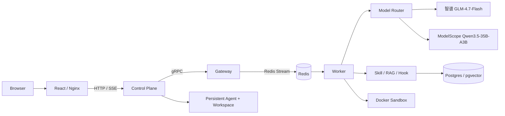

# AgentForge

AgentForge 是一个用 Go 实现的云原生 AI Agent Runtime。它提供 Web Agent Control Plane、gRPC/ACP 双入口、Redis Stream 执行链路、Docker 隔离工具、Skill/RAG 动态上下文、Multi-Agent Pipeline、WASM Hook、etcd 调度控制面和 Prometheus/Grafana 可观测性。

## 当前状态

- **W1-W10 Runtime：已完成。**
- **Web Dashboard + Agent Control Plane：已实现并完成本地端到端启动验证。**
- **模型：支持智谱 `glm-4.7-flash` 和 ModelScope `Qwen/Qwen3.5-35B-A3B`，分别使用独立密钥。**
- **ACP Agent-to-Agent Collaboration Gateway：设计完成，尚未实现。**

当前 Dashboard 支持：

- 创建带独立 Docker 容器和持久 workspace volume 的 Agent；
- 配置角色、系统提示词、资源额度、工具 allow-list 和 workspace 策略；
- 启动、停止、删除 Agent；
- 在详情页运行任务并查看 SSE 流式输出；
- 查看全局 Run 历史和只读 workspace 文件；
- 通过内置“使用指南”了解操作流程与能力边界。

## 核心架构



当前浏览器执行路径是：

```text
Browser → Web/Nginx → Control Plane → Gateway → Redis → Worker
       ← SSE           ← gRPC stream          ← events
```

详细数据流见 [`docs/ARCHITECTURE.md`](./docs/ARCHITECTURE.md)，容器寻址与网络隔离见 [`docs/CONTAINER_NETWORKING.md`](./docs/CONTAINER_NETWORKING.md)。

## 快速开始

```bash
test -f .env || cp .env.example .env
```

在 `.env` 中填写智谱 API Key，然后启动：

```bash
docker compose --env-file .env -f deploy/docker-compose.yml up -d --build
```

Apple Silicon 使用：

```bash
docker context use desktop-linux
docker buildx use desktop-linux
DOCKER_DEFAULT_PLATFORM=linux/arm64 docker compose \
  --env-file .env \
  -f deploy/docker-compose.yml \
  up -d --build
```

打开：

- Dashboard：`http://localhost:5173`
- Grafana：`http://localhost:3000`
- Prometheus：`http://localhost:9090`

完整步骤和故障排查见 [`STARTUP_GUIDE.md`](./STARTUP_GUIDE.md)。

## Runtime 能力

| 能力 | 当前实现 |
|---|---|
| 接入协议 | gRPC `RunAgent`、ACP v1 framed TCP、HTTP REST/SSE |
| 执行与状态 | Redis Streams、Redis Pub/Sub、mutable history、event replay |
| Agent 管理 | Agent Registry、持久容器、named workspace volume、生命周期管理 |
| 模型 | 智谱 GLM、ModelScope Qwen、按 Agent 模型路由、Mock provider |
| 工具隔离 | Docker L1 sandbox、资源限制、只读 rootfs、tool allow-list |
| 上下文 | Skill selector、pgvector RAG、history fold、context compaction |
| 编排 | Supervisor subagent、Pipeline DAG |
| 扩展 | Skill/RAG/Hook gRPC 服务、wazero WASI Hook |
| 调度 | etcd discovery、scheduler leader/pick |
| 可观测 | OpenTelemetry、Prometheus、Grafana、structured logging |
| 前端 | React、Vite、TypeScript、Ant Design、TanStack Query |

## 项目结构

```text
cmd/                  Go 服务与 CLI 入口
internal/             Runtime、Control Plane、LLM、RAG、Tool 等实现
pkg/proto/            Protobuf 契约
pkg/acp/              ACP v1 协议
web/                  React Dashboard
api/                  Control Plane OpenAPI
deploy/               Docker Compose 与可观测配置
docs/                 架构、手册、ADR、验收和项目表达材料
skills/               内置 Skill
hooks/                Hook 示例
```

## 文档入口

- 文档总索引：[`docs/README.md`](./docs/README.md)
- Dashboard 启动：[`STARTUP_GUIDE.md`](./STARTUP_GUIDE.md)
- 一页启动命令：[`docs/FRONTEND_TEST_QUICKSTART.md`](./docs/FRONTEND_TEST_QUICKSTART.md)
- CLI Runtime 手册：[`docs/CLI_RUNTIME_GUIDE.md`](./docs/CLI_RUNTIME_GUIDE.md)
- 项目设计：[`PROJECT_DESIGN.md`](./PROJECT_DESIGN.md)
- 当前架构：[`docs/ARCHITECTURE.md`](./docs/ARCHITECTURE.md)
- 容器通信：[`docs/CONTAINER_NETWORKING.md`](./docs/CONTAINER_NETWORKING.md)
- ACP 协议：[`pkg/acp/spec.md`](./pkg/acp/spec.md)
- 验收与演示：[`docs/ACCEPTANCE_CHECKLIST.md`](./docs/ACCEPTANCE_CHECKLIST.md)、[`docs/DEMO_SCRIPT.md`](./docs/DEMO_SCRIPT.md)

## 已实现与规划边界

已实现：

- Web Agent 创建、生命周期、Run、历史和只读 workspace；
- gRPC/ACP v1 外部入口；
- Docker L1 sandbox、Skill、RAG、Multi-Agent、Hook、Scheduler、Observability。

尚未实现：

- ACP Agent-to-Agent Task/Result Collaboration Gateway；
- Dashboard 中的多 Agent 拓扑、RAG 文档管理和 workspace 在线编辑；
- 登录、多租户、RBAC；
- gVisor、Firecracker、eBPF audit、Loki、Tempo。
