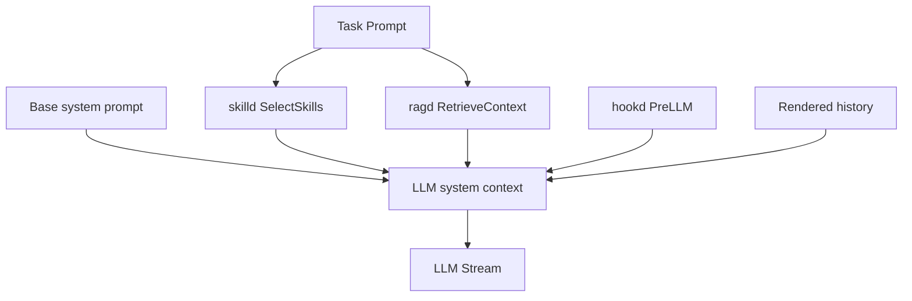
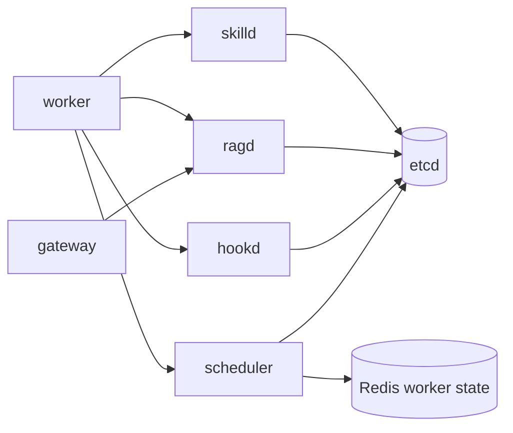
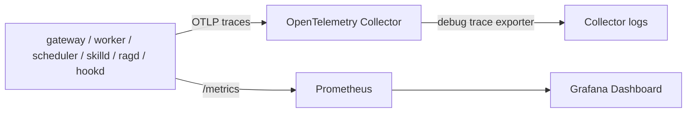

# AgentForge 架构图

AgentForge 的核心执行链路保持稳定，W5-W9 的 Skill、RAG、Hook、Multi-Agent、Scheduler 和 Observability 都围绕 worker/service 层扩展。

## 1. Runtime 主链路

```mermaid
flowchart LR
  CLI[agentctl] -->|gRPC RunAgent| GW[gateway]
  CLI -->|ACP TCP frames| ACP[gateway ACP]
  ACP --> GW
  GW -->|XADD queue:agent_tasks| Redis[(Redis)]
  Redis -->|XREADGROUP| Worker[worker]
  Worker -->|stream chat| LLM[OpenAI-compatible / Mock LLM]
  Worker -->|append/render/fold| History[(Redis History)]
  Worker -->|publish events| Redis
  Redis -->|events:{run_id}| GW
  GW -->|RunEvent stream| CLI
  Worker -->|Acquire / Exec / Release| Sandbox[Docker L1 Sandbox Pool]
```

核心含义：

- gateway 是外部入口。
- Redis Stream 是任务队列。
- worker 是执行节点。
- Redis Pub/Sub 把 worker 事件实时回推给 gateway。
- history 存在 Redis Hash/ZSet 中。
- tool 通过 Docker L1 sandbox 隔离执行。

## 2. Context Assembly



LLM context 顺序：

1. base system prompt
2. selected Skill content
3. RAG chunks，包在 `<untrusted>` 中
4. Hook 注入的 system message
5. 历史消息

这个顺序保证基础系统指令优先，外部检索内容不被误当成高优先级指令。

## 3. W8 服务拆分



拆分后：

- worker 不再直接本地加载 Skill/RAG/Hook。
- gateway 的 RAG CLI/RPC 仍保持原入口，但内部代理到 `ragd`。
- etcd 提供服务注册和 scheduler leader election。
- `scheduler pick` 是调度控制面 demo，主任务消费仍走 Redis Stream consumer group。

ADR：[`docs/adr/003-w8-service-split.md`](./adr/003-w8-service-split.md)

## 4. Observability Plane



W9 当前选择：

- 用 Prometheus + Grafana 做可见 dashboard。
- 用 OTel Collector 接收 trace，为后续 Tempo 留出口。
- 暂不引入 Loki / Tempo，降低 W10 交付复杂度。

ADR：[`docs/adr/004-w9-observability.md`](./adr/004-w9-observability.md)

## 5. 主要存储

- Redis Stream：agent/tool 任务队列、retry、DLQ。
- Redis Pub/Sub：run event fanout。
- Redis Hash/ZSet：mutable history、ACP event cache。
- Postgres + pgvector：RAG chunks 和向量检索。
- etcd：服务发现、scheduler leader election。

## 6. 兼容性承诺

- `RunAgent` public RPC 保持稳定。
- ACP frame shape 保持稳定。
- Tool descriptors 兼容 OpenAI-style function calling。
- Skill/RAG/Hook 默认可 fail open，服务不可用时回退到上一阶段行为。
