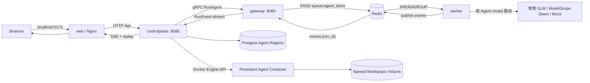
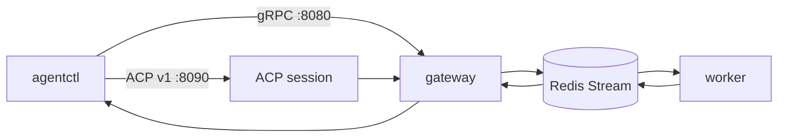
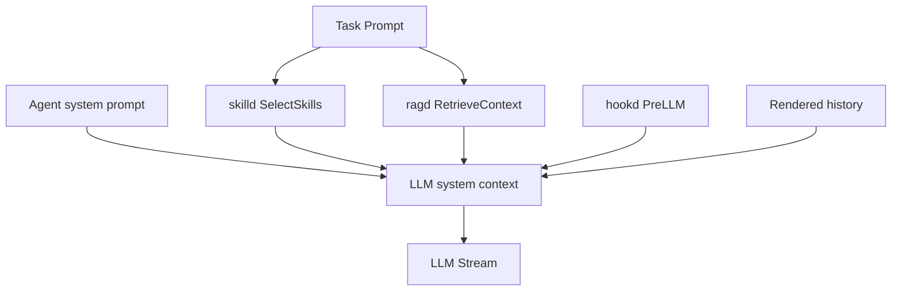
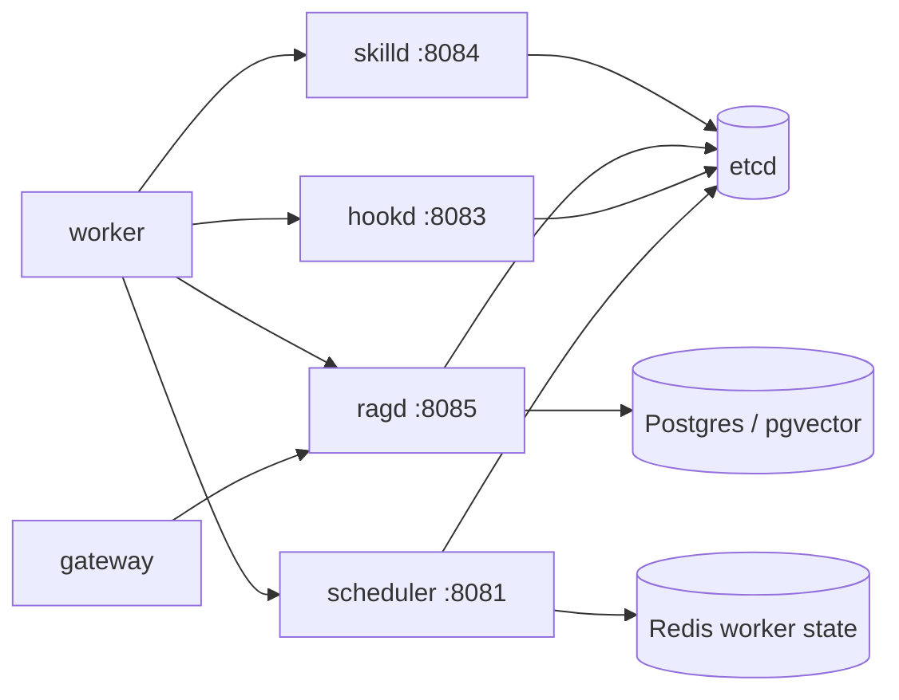
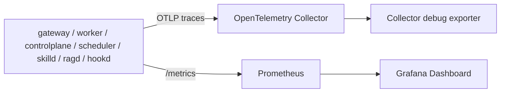
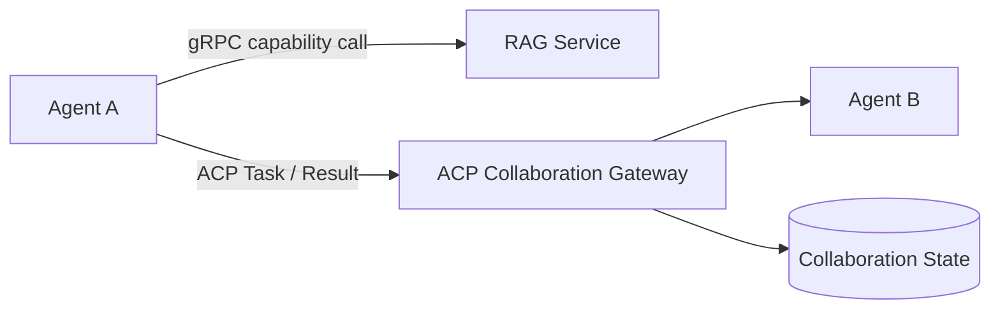

# AgentForge 当前架构

本文档只描述当前已经实现的系统数据流和模块边界。容器地址、端口和隔离规则见 [`CONTAINER_NETWORKING.md`](./CONTAINER_NETWORKING.md)；未来 ACP Agent 协作设计见 [ADR 005](./adr/005-agent-control-plane-and-collaboration.md)。

## 1. Dashboard 与 Runtime 主链路

```mermaid
flowchart LR
  Browser["Browser"] -->|"localhost:5173"| Web["web / Nginx"]
  Web -->|"HTTP /api"| CP["controlplane :8086"]
  CP -->|"gRPC RunAgent"| GW["gateway :8080"]
  GW -->|"XADD queue:agent_tasks"| Redis[("Redis")]
  Redis -->|"XREADGROUP"| Worker["worker"]
  Worker -->|"按 Agent model 路由"| LLM["智谱 GLM / ModelScope Qwen / Mock"]
  Worker -->|"publish events"| Redis
  Redis -->|"events:{run_id}"| GW
  GW -->|"RunEvent stream"| CP
  CP -->|"SSE + replay"| Web
  Web --> Browser

  CP --> Registry[("Postgres Agent Registry")]
  CP -->|"Docker Engine API"| Agent["Persistent Agent Container"]
  Agent --> Volume[("Named Workspace Volume")]
```

职责：

- Web 只访问同源 `/api`，Nginx 代理到 Control Plane。
- Control Plane 维护 AgentSpec/AgentRun、管理持久容器与 workspace，并将 Gateway gRPC 事件转换为浏览器 SSE。
- Gateway 是稳定的 Run 入口，将任务写入 Redis Stream。
- Worker 消费任务、装配上下文、调用模型和工具，并通过 Redis Pub/Sub 发布事件。
- Redis 保存任务、事件、history 和 UI 回放数据。
- Postgres 保存 Agent Registry、Run 元数据和 RAG 数据。

同一 Agent 同时只允许一个活跃 run，避免并发写入共享持久 workspace。

## 2. CLI 与双协议入口

```mermaid
flowchart LR
  CLI["agentctl"] -->|"gRPC :8080"| GW["gateway"]
  CLI -->|"ACP v1 :8090"| ACP["ACP session"]
  ACP --> GW
  GW --> Redis[("Redis Stream")]
  Redis --> Worker["worker"]
  Worker --> Redis
  Redis --> GW
  GW --> CLI
```

- gRPC 是工程化主入口。
- ACP v1 是 client ↔ gateway 的自研 framed stream，支持 session、event cache 和 resume。
- 两种入口复用相同 Gateway、Redis、Worker 执行链路。
- ACP v1 当前不承担 Agent-to-Agent Task/Result 路由。

协议规范见 [`pkg/acp/spec.md`](../pkg/acp/spec.md)，设计取舍见 [ADR 001](./adr/001-acp-vs-grpc.md)。

## 3. Context Assembly

```mermaid
flowchart TD
  Prompt["Task Prompt"] --> Skill["skilld SelectSkills"]
  Prompt --> RAG["ragd RetrieveContext"]
  Base["Agent system prompt"] --> Context["LLM system context"]
  Skill --> Context
  RAG --> Context
  Hook["hookd PreLLM"] --> Context
  History["Rendered history"] --> Context
  Context --> LLM["LLM Stream"]
```

上下文优先级：

1. Agent/base system prompt；
2. selected Skill；
3. 包在 `<untrusted>` 中的 RAG chunks；
4. Hook 注入的 system message；
5. 历史消息。

外部检索内容不会被当成高优先级系统指令。

## 4. 服务拆分与调度

```mermaid
flowchart LR
  Worker["worker"] --> Skilld["skilld :8084"]
  Worker --> Ragd["ragd :8085"]
  Worker --> Hookd["hookd :8083"]
  GW["gateway"] --> Ragd
  Worker --> Scheduler["scheduler :8081"]
  Skilld --> Etcd[("etcd")]
  Ragd --> Etcd
  Hookd --> Etcd
  Scheduler --> Etcd
  Scheduler --> Redis[("Redis worker state")]
  Ragd --> PG[("Postgres / pgvector")]
```

- Skill、RAG、Hook 是独立 gRPC 服务。
- Gateway 的 RAG 公共入口保持兼容，内部代理到 `ragd`。
- etcd 提供服务发现和 scheduler leader election。
- Scheduler `Pick` 是调度控制面；当前主任务仍由 Redis Stream consumer group 分发。

对应决策见 [ADR 003](./adr/003-w8-service-split.md)。

## 5. Tool 与容器生命周期

系统存在两类容器：

| 类型 | 生命周期 | Workspace | 用途 |
|---|---|---|---|
| Persistent Agent | 随 Agent 创建、停止、删除 | 每 Agent 独立 named volume | 持久身份与文件系统 |
| L1 Tool Sandbox | Worker 预热池按 run 获取和释放 | 受控临时 mount | bash、文件等工具隔离执行 |

共同安全策略：

- `NetworkMode: none`；
- read-only rootfs；
- drop all capabilities；
- `no-new-privileges`；
- CPU、内存、PID 和超时限制。

Control Plane 和 Worker 是唯一需要 Docker socket 的服务。普通 Agent 容器不直接访问 Redis、RAG、Docker daemon 或公网。详细边界见 [`CONTAINER_NETWORKING.md`](./CONTAINER_NETWORKING.md) 和 [ADR 002](./adr/002-sandbox-l1-scope.md)。

## 6. Observability Plane

```mermaid
flowchart LR
  Services["gateway / worker / controlplane / scheduler / skilld / ragd / hookd"] -->|"OTLP traces"| OTel["OpenTelemetry Collector"]
  Services -->|"/metrics"| Prom["Prometheus"]
  OTel --> Logs["Collector debug exporter"]
  Prom --> Grafana["Grafana Dashboard"]
```

- Prometheus + Grafana 展示运行时指标。
- OTel Collector 接收 trace，并为未来接入 Tempo 保留出口。
- 当前未引入 Loki/Tempo。

对应决策见 [ADR 004](./adr/004-w9-observability.md)。

## 7. 主要存储

| 存储 | 当前用途 |
|---|---|
| Redis Stream | Agent/Tool 任务、retry、DLQ |
| Redis Pub/Sub | Run event fanout |
| Redis Hash/ZSet/List | History、ACP event cache、UI SSE replay |
| Postgres | AgentSpec、AgentRun |
| Postgres + pgvector | RAG chunks、embedding、检索 |
| etcd | 服务发现、scheduler leader election |
| Docker named volume | 每 Agent 持久 workspace |

## 8. 已实现与未来设计

当前已实现：

- Dashboard、Control Plane、Agent Registry；
- 持久 Agent 容器与独立 workspace；
- Control Plane → Gateway gRPC Run；
- Redis-backed SSE 事件回放；
- gRPC/ACP v1 外部入口和完整 Runtime 链路。

未来设计：

```mermaid
flowchart LR
  A["Agent A"] -->|"gRPC capability call"| RAG["RAG Service"]
  A -->|"ACP Task / Result"| CG["ACP Collaboration Gateway"]
  CG --> B["Agent B"]
  CG --> Redis[("Collaboration State")]
```

ACP Collaboration Gateway 将负责 Agent 间结构化 Task/Result/Progress/Failure、鉴权、幂等、重试和回放。该能力尚未进入当前 Dashboard 或容器网络，不能作为已交付功能宣传。

## 9. 兼容性承诺

- `RunAgent` public RPC 保持向后兼容。
- ACP v1 frame shape 保持稳定。
- Tool descriptors 兼容 OpenAI-style function calling。
- Skill/RAG/Hook 可按配置 fail open。
- Web API 通过 Control Plane 暴露，不要求浏览器理解内部 gRPC、Redis 或 Docker。
