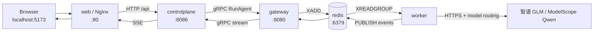

# AgentForge 容器通信与网络边界

本文档是 AgentForge 容器寻址、端口映射和网络隔离的单一事实来源。服务职责与数据流见 [`ARCHITECTURE.md`](./ARCHITECTURE.md)，启动命令见 [`STARTUP_GUIDE.md`](../STARTUP_GUIDE.md)。

## 1. Compose 默认网络

`deploy/docker-compose.yml` 未为主服务声明额外网络，因此 Docker Compose 自动创建：

```text
agentforge_default
```

Compose 服务加入该 bridge 网络后，Docker 内置 DNS 会把服务名解析为容器 IP。内部调用应使用：

```text
service-name:container-port
```

例如：

```text
redis:6379
postgres:5432
gateway:8080
controlplane:8086
ragd:8085
```

容器 IP 可能在重建后变化，不应写入配置。

## 2. 宿主机地址与容器地址

两种访问方式不能混用：

| 调用位置 | 正确形式 | 示例 |
|---|---|---|
| Mac/Windows/Linux 宿主机 | `localhost:映射端口` | `http://localhost:5173` |
| Compose 容器内部 | `服务名:容器端口` | `gateway:8080` |

容器中的 `localhost` 只代表该容器自己。例如，worker 使用 `redis:6379`，不能使用 `localhost:6379`。

`ports` 负责把容器端口暴露给宿主机；容器之间即使不声明 `ports`，也可以通过 Compose 网络访问对方监听的端口。

## 3. Dashboard 请求链路



浏览器只访问 Web 的 `localhost:5173`。Nginx 将同源 `/api/*` 和 `/healthz` 请求代理到 `controlplane:8086`，浏览器不直接访问 gRPC、Redis、Postgres 或 Docker socket。

## 4. 内部服务寻址契约

| 调用方 | 目标 | 协议 | 容器内地址 |
|---|---|---|---|
| `web` | `controlplane` | HTTP/SSE proxy | `controlplane:8086` |
| `controlplane` | `gateway` | gRPC | `gateway:8080` |
| `controlplane` | `redis` | Redis | `redis:6379` |
| `controlplane` | `postgres` | PostgreSQL | `postgres:5432` |
| `gateway` | `redis` | Redis | `redis:6379` |
| `gateway` | `postgres` | PostgreSQL | `postgres:5432` |
| `gateway` | `ragd` | gRPC | `ragd:8085` |
| `gateway` | `skilld` | gRPC | `skilld:8084` |
| `gateway` | `hookd` | gRPC | `hookd:8083` |
| `gateway` | `etcd` | HTTP/gRPC | `etcd:2379` |
| `gateway` | `otel-collector` | OTLP gRPC | `otel-collector:4317` |
| `worker` | `redis` | Redis | `redis:6379` |
| `worker` | `postgres` | PostgreSQL | `postgres:5432` |
| `worker` | `scheduler` | gRPC | `scheduler:8081` |
| `worker` | `ragd` | gRPC | `ragd:8085` |
| `worker` | `skilld` | gRPC | `skilld:8084` |
| `worker` | `hookd` | gRPC | `hookd:8083` |
| `worker` | `etcd` | HTTP/gRPC | `etcd:2379` |
| `worker` | `otel-collector` | OTLP gRPC | `otel-collector:4317` |
| `ragd` | `postgres` | PostgreSQL | `postgres:5432` |

这些地址由 `deploy/docker-compose.yml` 的环境变量提供。修改服务名或监听端口时，应同步更新 Compose、本文档和相关健康检查。

## 5. 宿主机端口

端口映射主要用于开发、CLI 和观测：

| 地址 | 用途 |
|---|---|
| `localhost:5173` | Web Dashboard |
| `localhost:8086` | Control Plane HTTP API |
| `localhost:8080` | Gateway gRPC |
| `localhost:8090` | Gateway ACP v1 |
| `localhost:8081` | Scheduler gRPC |
| `localhost:8082` | Scheduler HTTP |
| `localhost:8083` | Hook gRPC |
| `localhost:8084` | Skill gRPC |
| `localhost:8085` | RAG gRPC |
| `localhost:3000` | Grafana |
| `localhost:9090` | Prometheus |
| `localhost:6379` | Redis 开发访问 |
| `localhost:5432` | Postgres 开发访问 |
| `localhost:2379` | etcd 开发访问 |
| `localhost:4317` | OTLP gRPC |

生产部署不应默认公开全部基础设施端口，应只暴露必要入口并通过网络策略限制访问。

## 6. `depends_on` 不等于网络连接

`depends_on` 只描述启动顺序和部分健康条件：

- `service_started`：目标容器已启动，不代表应用已经可用。
- `service_healthy`：目标健康检查已通过。
- 没有 `depends_on` 的服务仍可通过 `agentforge_default` 网络通信。

应用仍需处理连接失败、启动竞态和短暂重连，不能把 `depends_on` 当作服务发现或可靠性机制。

## 7. Docker socket 边界

只有可信控制组件挂载：

```text
/var/run/docker.sock
```

- `controlplane` 使用 Docker Engine API 创建、启动、停止和删除持久 Agent 容器与 workspace volume。
- `worker` 使用 Docker Engine API 管理临时 Tool Sandbox。
- `web`、`gateway`、`skilld`、`ragd`、`hookd`、普通 Agent 容器都不应获得 Docker socket。

Docker socket 等价于较高宿主权限，只能暴露给受信任服务。

## 8. Agent 与 Sandbox 隔离

持久 Agent 容器和临时 Sandbox 都设置 `NetworkMode: none`：

- 不加入 `agentforge_default`。
- 不能直接访问 Redis、Postgres、RAG、内部 gRPC 服务或公网。
- 根文件系统只读，并限制 capabilities、CPU、内存和 PID。
- 持久 Agent 只有 `/workspace` named volume 可写。
- 临时 Sandbox 通过受控 workspace mount 执行工具。

因此当前实现不是“Agent 容器直接调用 RAG”。模型、RAG、Skill、Hook 和数据库访问由可信的 gateway/worker 链路完成；Agent 容器承担持久工作区和受控工具执行目标。

未来的 Agent-to-Agent ACP Collaboration Gateway 仍处于规划阶段，不属于当前容器网络。

## 9. gRPC、ACP 与 Redis 的职责

- HTTP/SSE：浏览器与 Control Plane 的管理、查询和流式显示。
- gRPC：Control Plane、Gateway、Scheduler、RAG、Skill、Hook 等服务调用。
- Redis Stream/PubSub：任务队列、worker 消费和运行事件广播。
- ACP v1：CLI/client 到 Gateway 的自研 framed stream 与 resume。
- 规划中的 ACP Collaboration：未来传递 Agent Task/Result，不是当前 Dashboard 执行路径。

## 10. 排查方法

查看 Compose 网络：

```bash
docker network inspect agentforge_default
```

查看服务状态：

```bash
docker compose --env-file .env -f deploy/docker-compose.yml ps
```

查看主链路日志：

```bash
docker compose --env-file .env -f deploy/docker-compose.yml \
  logs -f web controlplane gateway worker
```

业务镜像使用 distroless，通常不包含 `getent`、`nslookup` 等诊断命令。可临时启动一个加入同一 Compose 网络的 Alpine：

```bash
docker run --rm --network agentforge_default alpine:3.19 \
  nslookup gateway
```

常见错误：

| 现象 | 原因 |
|---|---|
| 容器访问 `localhost:6379` 失败 | `localhost` 指向当前容器，应改为 `redis:6379` |
| 宿主机访问 `gateway:8080` 失败 | Compose 服务名只在内部 DNS 生效，应使用 `localhost:8080` |
| 服务已 started 但连接被拒绝 | 应用尚未就绪，检查健康状态与日志 |
| Agent 容器访问内部服务失败 | 这是 `NetworkMode: none` 的预期隔离行为 |
| Control Plane 无法创建 Agent | 检查 Docker socket、基础镜像和 Control Plane 日志 |
